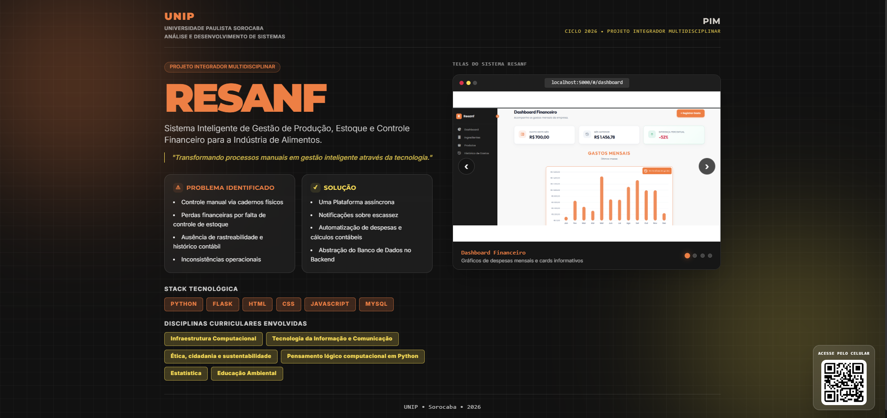
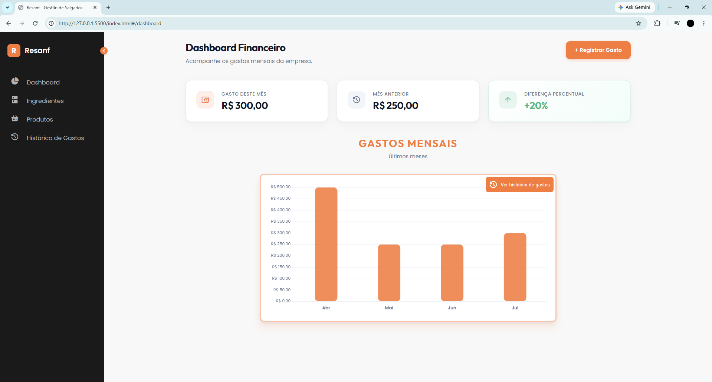
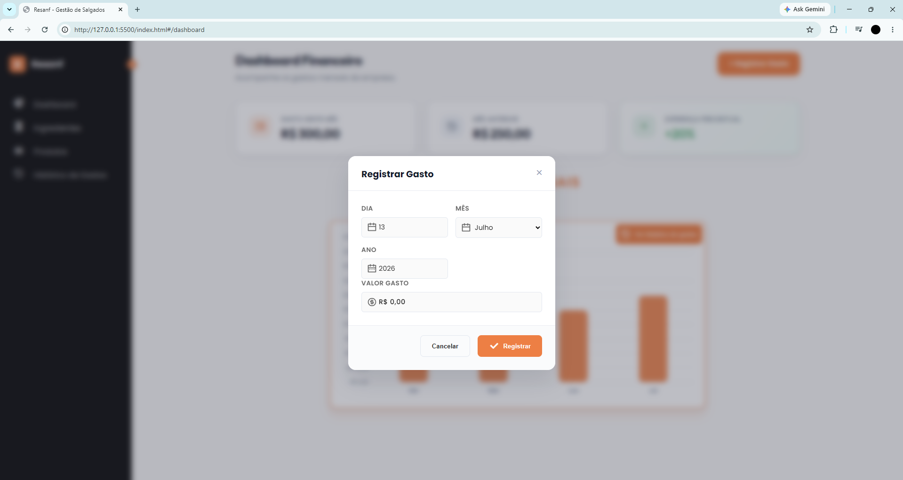
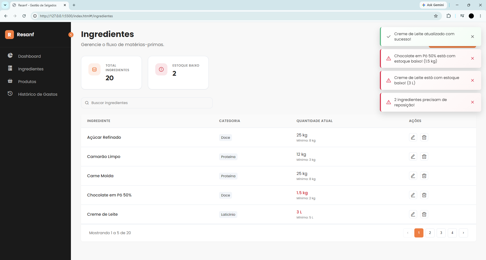
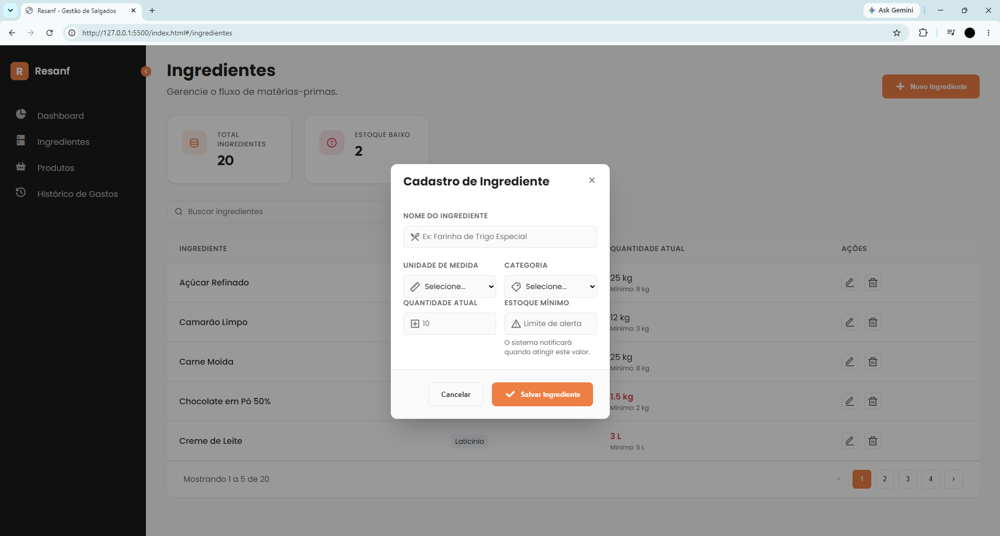
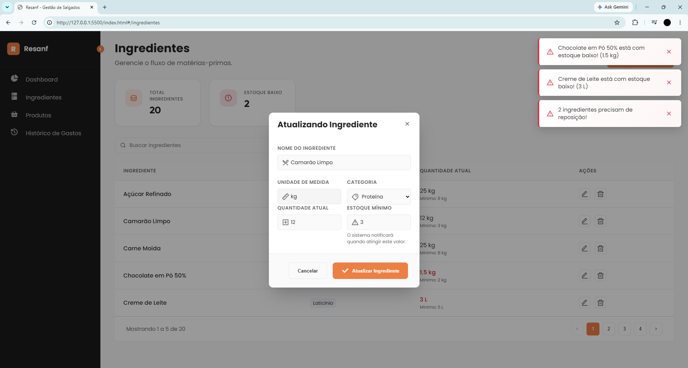
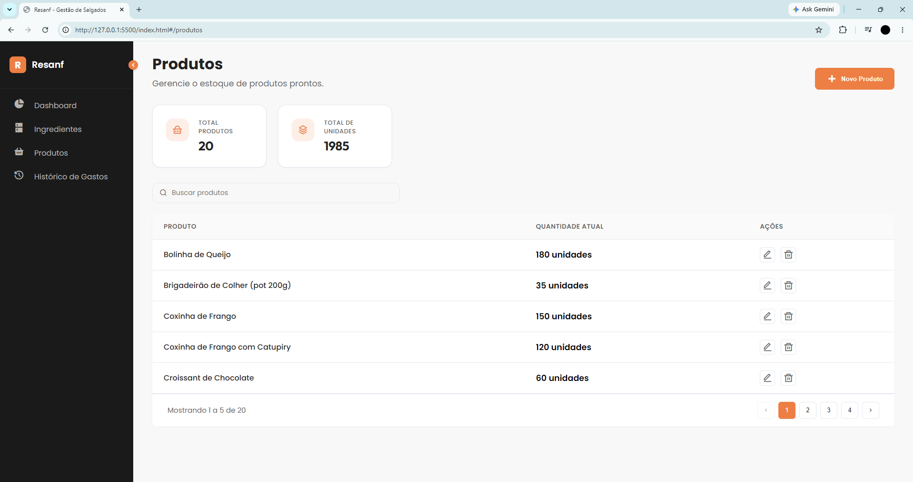
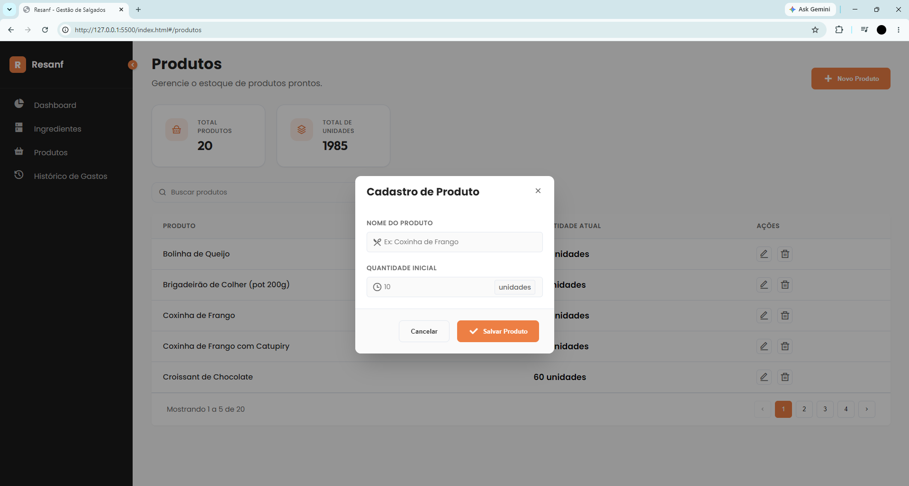
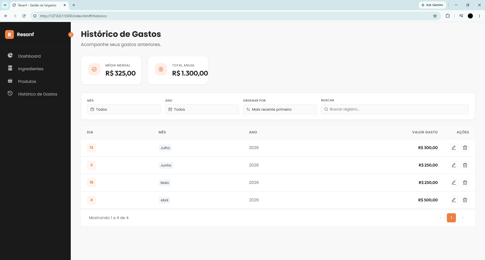

<h1 align="center">🥟 RESANF SALGADOS</h1>
<h3 align="center">Sistema Inteligente de Gestão de Produção, Estoque e Controle Financeiro</h3>
<p align="center">
  <i>Projeto Integrador Multidisciplinar (PIM) — UNIP Sorocaba | Análise e Desenvolvimento de Sistemas (2026)</i>
</p>

<p align="center">
  
</p>

> **"Transformando processos manuais em gestão inteligente através da tecnologia."**

---
> ⚠️ **Nota:** Todos os dados exibidos nas demonstrações do sistema são fictícios e gerados estritamente para fins acadêmicos.


## 📌 Contexto, Problema e Valor Agregado

A **Resanf Salgados** é uma empresa atuante no setor alimentício especializada na produção de salgados artesanais e congelados. Antes da concepção do sistema, toda a cadeia de suprimentos, receitas, registros financeiros e contagem de freezer eram operados de forma **100% manual via cadernos e anotações físicas**.

## 🛑 O Problema
* **Inconsistência Operacional:** Ausência de histórico contábil unificado e vulnerabilidade a perda de dados.
* **Desperdício Financeiro:** Falta de controle sobre estoque mínimo de insumos e prazo de validade de matérias-primas.
* **Gargalo de Tempo:** Contagem manual de congelados em estoque demandava horas operacionais da gestão.

## 💡 Valor Gerado para a Empreendedora
* **⚡ Ganho Operacional:** Substituição da contagem manual feitas em cadernos por atualização centralizada em tempo real.
* **🛡️ Proteção de Margem:** Sistema de alertas ativos prevenindo a paralisação da produção por falta de ingredientes.
* **📊 Visão Executiva:** Métricas e relatórios gráficos consolidados para tomadas de decisão baseadas em dados reais.

---

## 👥 Equipe de Desenvolvimento - _Atuação de Cada um durante o Desenvolvimento do Projeto_
* **[Victor Dutra](https://www.linkedin.com/in/victordutra-/)** — *Líder de Projeto & Desenvolvedor Backend & DBA*
* **[Thayson Sousa](https://www.linkedin.com/in/thayson-sousa/)** — *Desenvolvedor Frontend / UX-UI*
* **[Pietro Assis](https://www.linkedin.com/in/pietro-assis-961954392/)** — *Desenvolvedor Backend*
* **[Igor Miranda](https://github.com/igor-miranda1)** — *Desenvolvedor Backend*


### 📚 Disciplinas Envolvidas (UNIP)
`Infraestrutura Computacional` · `Tecnologia da Informação e Comunicação` · `Ética, Cidadania e Sustentabilidade` · `Pensamento Lógico Computacional em Python` · `Estatística` · `Educação Ambiental`

---

## 🛠️ Stack Tecnológica & Arquitetura

* **Backend:** Python 3 · Flask (API Web)
* **Persistência & ORM:** SQLAlchemy
* **Banco de Dados:** MySQL (XAMPP / Localhost)
* **Frontend:** HTML5 · CSS3 · JavaScript (Vanilla ES6+)
* **Padrão de UX:** Interface assíncrona orientada a modais (redução de reload de páginas)

---

## 💻 Módulos do Sistema & Demonstração Visual

### 📊 1. Dashboard Financeiro (Análise Executiva)
**Propósito:** Prover uma leitura imediata do comportamento financeiro da empresa com comparativos mensais.

* **Cards de KPI:** Gastos do mês atual, consolidado do mês anterior e variação percentual dinâmica.
* **Gráfico de Tendência:** Visualização das despesas ao longo dos últimos meses.
* **Ação Rápida:** Registro de novas saídas através de modal sobreposto com validação de campo.

<p align="center">
  
</p>

<details>
<summary>🔍 <b>Clique para visualizar o Modal de Registro de Gastos</b></summary>
<br>
<p align="center">
  
</p>
</details>

---

### 📦 2. Gestão de Ingredientes (Matérias-Primas & Alertas)
**Propósito:** Garantir o controle dos insumos armazenados e prevenir a interrupção da linha de produção.

* **Métricas de Estoque:** Contagem total de insumos e destaque para itens abaixo do limite mínimo.
* **Central de Notificações (Toasts):** Alertas flutuantes empilhados avisando quando um ingrediente precisa de reposição urgente.
* **Tabela Categorizada:** Organização por badges (`Proteína`, `Laticínio`, `Doce`) e indicação de quantidade crítica em vermelho.

<p align="center">
  
</p>

<details>
<summary>🔍 <b>Clique para visualizar os Modais de Cadastro e Edição de Insumos</b></summary>
<br>

#### Cadastro de Ingredientes
<p align="center">
  
</p>

#### Atualização e Baixa de Estoque
<p align="center">
  
</p>
</details>

---

### 🧊 3. Controle de Produtos Prontos (Salgados Congelados)
**Propósito:** Dar visibilidade sobre o volume de produtos acabados nos freezers, prontos para comercialização.

* **Indicadores Consolidados:** Total de tipos de salgados cadastrados e soma geral de unidades em freezer (ex: `1.985 unidades`).
* **Inclusão Rápida:** Modal simplificado para entrada de novas fornadas no estoque.

<p align="center">
  
</p>

<details>
<summary>🔍 <b>Clique para visualizar o Modal de Cadastro de Produto</b></summary>
<br>
<p align="center">
  
</p>
</details>

---

### 📜 4. Histórico de Gastos (Auditoria & Rastreabilidade)
**Propósito:** Servir como livro-caixa digital e auditável para consultas retroativas.

* **Consolidado Anual:** Cálculo dinâmico da média de custos mensais e total acumulado no ano.
* **Filtros e Busca:** Pesquisa por período (mês/ano) e campo de busca textual em tempo real.

<p align="center">
  
</p>

---

### Ilustração Banner
<p align="center">
  
</p>

---

## 📁 Estrutura de Pastas do Repositório (Documentação Visual)

```bash
system-estoque-resanf-salgados-portfolio/
├── assets/                  # Todas as imagens e capturas de tela do sistema
└── README.md                # Este guia visual e técnico de portfólio
```


## ⚠️ Disclaimer e Direitos Autorais

Este é um projeto acadêmico desenvolvido para solucionar uma dor real de mercado. Dados exibidos nas imagens são ilustrativos para proteção da cliente. O código-fonte integral é mantido em repositório privado.

Copyright © 2026 por Victor Dutra, Pietro Assis, Thayson Sousa e Igor Miranda. **Todos os direitos reservados**.
